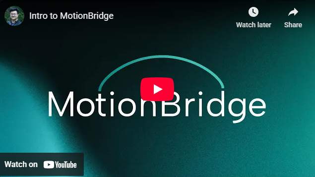
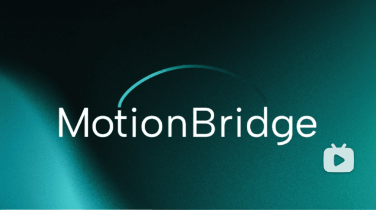
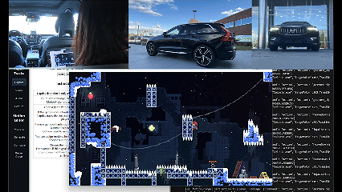
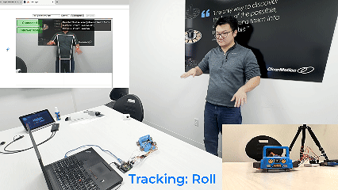
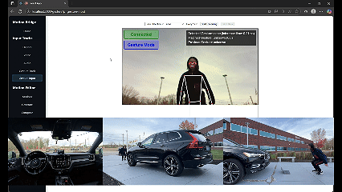
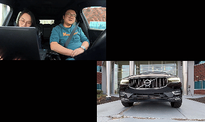
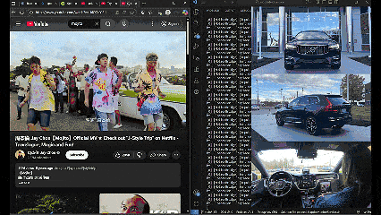
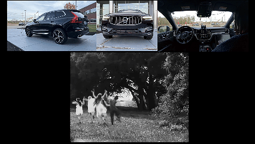
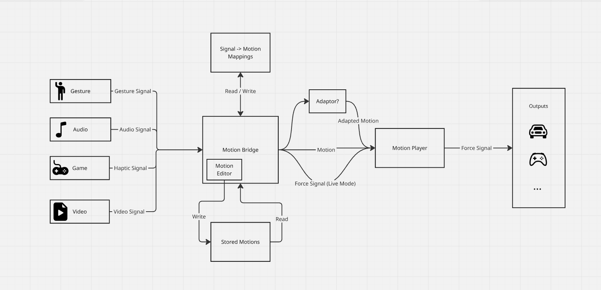
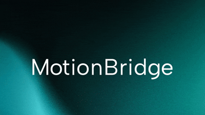

# MotionBridge

**MotionBridge** is the foundation of a modular system that connects digital events—whether from games, media, or live sensors—to real-world motion outputs such as vehicle actuators, moving seats, or DIY hardware. This repository defines the core architecture, runtime system, mapping logic, and hardware interfaces that convert semantic or continuous input into physical motion.

---

## Demos

### Overview Video

[](https://youtu.be/uY4mLN2Ui4U?si=ybpV0BPzUzBu3Kyy)

_Click to watch the MotionBridge overview on YouTube._

[](https://www.bilibili.com/video/BV1dm2pBrEzf/?share_source=copy_web&vd_source=629ad16bff51ddda62d7fabc3f71702a)

_Click to watch the MotionBridge overview on Bilibili._


### Feature Demos

#### Gaming



See the [full demo video on YouTube](https://www.youtube.com/watch?v=WuJL-lZ2yOM).

#### Gesture to a DIY Arduino model



See the [full demo video on YouTube](https://www.youtube.com/watch?v=hp64H7fhBo0).

#### Gesture to Car



See the [full demo video on YouTube](https://www.youtube.com/watch?v=XlkQjSWg30U).

#### Karaoke in Car



See the [full demo video on YouTube](https://youtu.be/vqWvWI-B4GA?si=sSsiqtjdXtgsImTJ).


#### Live Beats to Car



See the [full demo video on YouTube](https://youtu.be/vqWvWI-B4GA?si=sSsiqtjdXtgsImTJ).


#### Video Motion Track to Car



See the [full demo video on YouTube](https://youtu.be/qrCL8UxEofs).

---

## Key Concepts

- **Motion Bridge**

The main server that maps various input signals to motions and allows the user to edit the mappings and motions.

- **Motion Player**

Core playback engine that runs in three modes:

- Off
- Event (play motions in response to triggers)
- Live (map continuous signals to motion in real time)
- **Motion Editor**

A subdivision of Motion Bridge that edits motion specifically.

- **Input Layer**

Modular sources of events or signals: camera gestures, haptics data, etc.

- **Motion Mappings**

Convert various input types into motion primitives or force commands.

- **Motion Library**

Hardware-agnostic descriptions of motions (JSON format). Can be edited, simulated, or sent to actuators.

- **Output Layer**

  Interfaces for sending force commands to output devices.

---

## MotionBridge Architecture



---

## Updated Project Structure (Pending Edit)

```text
motionbridge/
├── apps/
│   ├── motion_bridge.py          # Motion bridge app entry point
│   ├── motion_bridge_utils.py    # Motion bridge properties and methods
│   ├── jedi_mapping_editor.py            # Gesture related routes
│   ├── video_mapping_editor.py     # Video related routes
│   └── motion_editor.py          # Motion editor routes
│
├── frontend/               # React frontend for the server
│   ├── App.tsx             # List all React routes
│   └── src
│       ├── adaptors/       # Frontend for custom adaptors
│       ├── components/     # React components
│       ├── hooks           # React hooks
│       ├── jsx             # Tsx components translated from jsx
│       ├── layouts         # Layout for pages
│       ├── pages           # React pages as routes
│       ├── services        # HTTP request functions and other helper functions
│       ├── shared          # Shared types across frontend
│       └── layouts         # layout for pages
│
├── public/                 # Large media files for displaying MotionBridge utilities
│   ├── audios              # Saved audios
│   └── videos/             # Saved videos, along with corresponding motion mappings
│
├── editor_utils/                 # Motion Editor Utilities
│   ├── motion_locks.py     # Motion library safety lock system
│   └── motion_presets.py   # Saved motion generation parameters
│
├── generator/              # Motion generation functions
│
├── motions/                # Motion library
│
├── mappings/                 # Motion mappings that map input to motions
│
├── player/                 # Motion player
│   ├── motion_player_main.py    # Main motion player program and controller
│   ├── motion_player.py         # Motion player model
│   └── player_utils.py          # Motion player utilities
│
├── input/                  # Drivers for input services
│   ├── HapticsMonitorService/   # Capture haptics input from system and send them to motionbridge
│   ├── audio
│   │   └── beat_detector.py     # Extract live beat from system audio
│   └── jedi/
│       ├── models/             # Trained gesture recognition models
│       ├── gestureClassifier.py
│       └── jedi_utils.py       # jedi helper functions
│
├── output/                 # Drivers for output devices
│   ├── bridge_driver.py    # Send motionplayer force signals back to motionbridge and frontend ui
│   ├── arduino_driver.py   # Send force signal to arduino panel connected with USB
│   ├── gamepad_driver.py   # Send force signal to GamepadDriver
│   └── GamepadDriver/      # Second Layer C++ Driver that sends force signals to connected gamepads
│
│
├── package.json            # App shortcuts
│
├── requirements.txt        # Python dependencies for MotionBridge
│
├── requirements_jedi.txt   # Extra python dependencies for training gesture models
│
└── README.md
```

---

## Goals

- Provide a **modular runtime** for motion playback
- Enable reuse across different application modes (Jedi, Gaming, Dancer, etc.)
- Support **real-time demos**:
  - Gesture-based force playback (Jedi Mode)
  - Gaming synced to vehicle motion
  - Live force streaming from signals

---

## Getting Started

### Start MotionBridge Server

> **Tips:** A convenient thing you can do is to check the `package.json` in the root folder.

When you cloned the repository to your computer, the first thing you should do is to create and activate the python virtual environment.

After that, you need to install the dependencies for frontend and backend. You can conveniently do this with `npm install`.

- To install python dependencies only, use `npm run i:py`
- To install frontend dependencies only, use `npm run i:js`

Now, you are ready to go!

- Type `npm run server` to start the backend server.
- Type `npm run client` in another terminal to start the frontend server.
- Type `npm start` to start both the backend and frontend

Backend server will be running on port `6789` and frontend on `3000`. A websocket route will be listening on `ws://localhost:6789/`.

Initial booting might take a couple minutes. Please wait patiently.

### Start MotionPlayer

You can start the MotionPlayer in the frontend or by entering `npm run player` in a new terminal.
To specify the player target, you can use argument `--target` or `-t`.
To specify the mode, you can use argument `--mode` or `-m`.

Modes:

- off
- event (play motions in response to triggers)
- live (map continuous signals to motion in real time)

### Playing with MotionBridge

There are builtin outputs that you can play with.

- Start the MotionPlayer and set target to bridge
- Click the arrow box icon next to the Output tab in the navbar and two simulation graphs will show up.
- Go to a random input page (video is the fastest one I think) and feed MotionBridge with inputs. The simulation graphs should move when an event occurs.

### Input Drivers

For some inputs or outputs, you need some extra steps to set up a driver before using them.

**Haptics Monitor (Haptics Mapping)**

This program is only compatible with Windows. It relies on [ViGemBus](https://github.com/nefarius/ViGEmBus), a virtual gamepad driver for Windows system.

You can run it from frontend or by command `npm run haptics`.

It detects every haptics signal and identifies the owner of the current active window as the signal source. This method is deflected and could make mistakes.

**Beat Detector (Audio Mapping)**

First, you need to install [PortAudio](https://www.portaudio.com/). Installation varies across different OS.

Once installed, you can run it from frontend or by command `npm run audio`.

You may also want to route internal audio to system input and adjust the input volume.

**Gamepad Driver (Gamepad Output)**

First, connect at least one gamepads to your computer.
Then, start GamepadDriver in MotionBridge webpage or run `npm run gamepad` to also view debug information.

---

## Acknowledgement

This project is based on the following projects:

- [BeatNet](https://github.com/mjhydri/BeatNet) for Audio Detection.
- [Mediapipe](https://chuoling.github.io/mediapipe/) for Gesture Detection
- [ViGemBus](https://github.com/nefarius/ViGEmBus) for Haptisc Detection

Many thanks for your amazing works.

---

## License

MotionBridge's original source code is licensed under the [MIT License](LICENSE).

This repository also includes and depends on third-party software and content
licensed under Apache-2.0, BSD-3-Clause, CC BY 4.0, LGPL-2.1-or-later, ISC, and
other permissive open-source licenses. Full details, including required
attributions and links to license texts, are documented in
[ATTRIBUTIONS.md](ATTRIBUTIONS.md) and the `third_party_licenses/` directory.

---

## Contact

Maintained by [Yu Jiang](https://github.com/yu-jiang) and [Ocean Zhang](https://github.com/OceanMyang) in a personal capacity.


